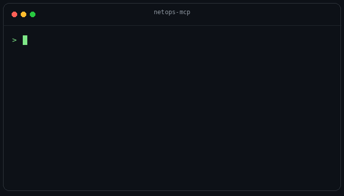

# netops-mcp

**Diagnose connectivity and inspect your tunnels — locally, from your AI assistant.**

<p align="center">
  
</p>

An MCP server that runs network diagnostics **from your own machine and inside your own network** (homelab, VPN, private subnets) — not from a remote probe. It gives your assistant a *verdict*, not just raw command output.

```
"Why can't I reach api.example.com?"
→ resolves DNS locally, pings, checks TCP/TLS, asks Globalping if it's up elsewhere,
  reads your /etc/hosts — and tells you: "It's your side. /etc/hosts line 12 pins it to a stale IP."
```

## Why it's different

- **Local-first.** Tests run from your host, so it sees your homelab, your VPN, your `/etc/hosts`, your resolvers. Remote-probe services can't.
- **Verdicts, not data.** `net_diagnose` and `net_triangulate` reason across DNS/TCP/TLS/HTTP and local config to tell you *where* the fault is.
- **Safe by default.** Read-only. Anti-scan caps. Zero telemetry. Audit log. See [SECURITY.md](./SECURITY.md).

## Install

```bash
npx netops-mcp
```

### Claude Desktop / Cursor / Claude Code — `mcp.json`

```json
{
  "mcpServers": {
    "netops": {
      "command": "npx",
      "args": ["-y", "netops-mcp"]
    }
  }
}
```

Privacy-strict (no third-party calls at all):

```json
{
  "mcpServers": {
    "netops": {
      "command": "npx",
      "args": ["-y", "netops-mcp", "--local-only"]
    }
  }
}
```

## Tools (v0.1)

| Tool | What |
|---|---|
| `net_diagnose` | One-shot "why can't I reach X" — DNS→ping→TCP→TLS→HTTP + verdict |
| `net_triangulate` | **Is it me or them?** Local probe vs Globalping worldwide probes |
| `config_correlate` | Cross-check `/etc/hosts` & `resolv.conf` against live DNS |
| `tunnel_diff` | Direct vs interface/tunnel egress identity & reachability |
| `dns_leak_check` | Egress IP + which resolvers you actually use (leak heuristics) |
| `wg_status` | WireGuard interfaces/peers, stale-handshake flags (read-only) |
| `wg_config_generate` | Fresh keypair + ready-to-paste client config (read-only) |
| `wg_peer_add` | Add/update a peer — gated by `--enable-write`, dry-run unless `confirm` |
| `wg_peer_remove` | Remove a peer — gated by `--enable-write`, dry-run unless `confirm` |
| `net_overview` | Interfaces + resolvers + WG snapshot |
| `dns_lookup` | A/AAAA/MX/TXT/NS/CNAME, custom resolver |
| `net_ping` | ICMP with TCP-ping fallback (no root needed) |
| `tcp_port_check` | Connectivity check of **named** ports (not a scan) |
| `tls_inspect` | Cert chain, expiry, SANs, protocol/cipher, handshake timing |
| `http_probe` | Status, redirects, DNS/connect/TLS/TTFB timing breakdown |
| `traceroute` | Hop-by-hop path to a host with per-hop latency |
| `mtu_blackhole` | Path-MTU discovery; catches MTU black holes (VPN "connects then hangs") |
| `cert_sweep` | Check TLS expiry across many domains; auto-extracts from nginx/Caddy/compose |
| `diagnosis_bundle` | Full probe battery → shareable Markdown report for bug tickets |

## Flags & env

| Flag / Env | Effect |
|---|---|
| `--local-only` / `NETOPS_LOCAL_ONLY=1` | Disable all outbound third-party calls (Globalping, egress echo) |
| `--enable-write` / `NETOPS_ENABLE_WRITE=1` | Allow mutating WireGuard ops (`wg_peer_add/remove`); still dry-run unless `confirm:true` |
| `--no-audit` | Silence the stderr audit log |
| `NETOPS_ALLOW` | Comma/space list of allowed targets (host or CIDR) — strict mode |
| `NETOPS_DENY` | Denylist of targets |
| `NETOPS_MAX_PORTS` | Cap for `tcp_port_check` (default 20) |

## Develop

```bash
npm install
npm run build
node dist/index.js          # or: npm run dev
```

## Demo

The animation above is rendered offline via `assets/make_gif.py`. For an authentic
terminal recording from the **real** server, install [VHS](https://github.com/charmbracelet/vhs)
and run `vhs demo/demo.tape` (drives `demo/cli.mjs`, where `config_correlate` is a genuine
call). The `regenerate demo gif` GitHub Action keeps `assets/cli.gif` up to date.

## Roadmap (v0.2+)

`dns_diagnose` (deep), `mtr`, HTTP/SSE transport, optional `--enable-scan` nmap mode.

## License

MIT
