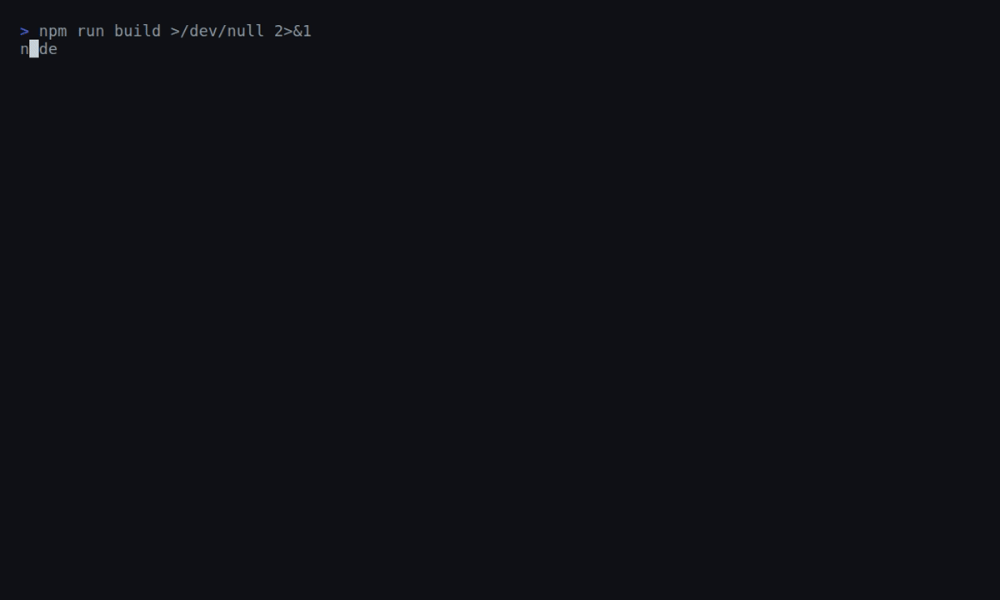

<p align="center">
  <picture>
    <source media="(prefers-color-scheme: dark)" srcset="assets/logo-dark.svg">
    <source media="(prefers-color-scheme: light)" srcset="assets/logo-light.svg">
    
  </picture>
</p>

<p align="center">
  <strong>Network diagnosis that tells you whose side the problem is on — locally.</strong>
</p>

<p align="center">
  <a href="https://github.com/Socialpranker/netops-mcp/actions/workflows/ci.yml"></a>
  <a href="LICENSE"></a>
  
  
  
  
</p>

<p align="center">
  
</p>

<details>
<summary><strong>📑 Table of contents</strong></summary>

- [What is this?](#what-is-this)
- [Why it's different](#why-its-different)
- [A network tool you can hand your assistant safely](#a-network-tool-you-can-hand-your-assistant-safely)
- [What you actually get back](#what-you-actually-get-back)
- [Tools (v0.1)](#tools-v01)
- [Install](#install)
- [Reference &amp; advanced](#reference--advanced)
  - [Flags &amp; env](#flags--env)
  - [Requirements &amp; platform support](#requirements--platform-support)
  - [The shareable report](#the-shareable-report)
  - [cert_sweep: point it at your reverse proxy](#cert_sweep-point-it-at-your-reverse-proxy)
- [Develop](#develop)
- [Demo](#demo)
- [Roadmap (v0.2+)](#roadmap-v02)
- [Contributing](#contributing)
- [License](#license)

</details>

## What is this?

The site loads for everyone but you. Your assistant runs `ping`/`dig`/`curl`, dumps three screens of records, RTTs and exit codes, and leaves you to decode them. A cloud uptime checker is no better — it pings from its own data center, sees the public internet is fine, and reports *"up."* True for the data center, useless to you: the checker was never on your machine, so it can't see the reason.

netops-mcp runs **on your machine**. That single fact unlocks the layer cloud probes are structurally blind to — your `/etc/hosts`, your VPN routes, your local resolvers, your homelab. It walks every hop between you and the host (DNS → ping → TCP → TLS → HTTP), cross-checks against worldwide probes via Globalping, and returns a **verdict** instead of raw output: which side the fault is on, and why.

So when a site is "down for you but up for the world," you don't get *"ping says 100% loss."* You get *"`/etc/hosts:2` pins it to a dead `10.0.0.5`; that's why."* — the catch a remote probe can't make, because the offending line lives on your disk.

```
   Cloud checker                      netops-mcp (on YOUR machine)
   ─────────────                      ────────────────────────────
   probes from a data center          probes from where YOU are
   sees: the public internet          sees: /etc/hosts, VPN, resolvers,
                                             homelab — AND the public net
        │                                   │
        ▼                                   ▼  DNS→ping→TCP→TLS→HTTP
   "Site is up. ✓"                     + Globalping: up elsewhere?
   (true — and no help                      │
    to you)                                 ▼
                              "YOUR SIDE: down for you but reachable
                               from 3/3 global probes. /etc/hosts:2
                               pins it to a stale 10.0.0.5 — remove it."
```

In short: **a translator between *"the network is broken"* and *"here's the exact line that's breaking it."*** Raw output tells you what happened; netops-mcp tells you what to do about it.

## Why it's different

- **Sees what cloud probes structurally can't.** A SaaS checker fires from its own data center, so it's blind to the things that actually break a site *for you* — a stale `/etc/hosts` pin, a VPN route, a captive local resolver. Running on your host, `config_correlate` reads them directly. That's why it can say `/etc/hosts:2 pins api.example.com -> 10.0.0.5; this OVERRIDES DNS` while a remote probe insists everything is fine.
- **A verdict, not a data dump.** `net_triangulate` runs the same reachability test from your machine *and* from Globalping, then names the side at fault: `YOUR SIDE: api.example.com is down for you but reachable from 3/3 global probes` versus `THEIR SIDE: ... unreachable from you AND from all 3 global probes`. `net_diagnose` walks DNS → ping → TCP → TLS → HTTP locally and verdicts where the chain breaks. One answer with the raw probes underneath it — not a wall of output to interpret yourself.
- **Safe by default.** Read-only. No shell — every system call is `execFile` with an argv array, never a string, so there's nothing for a hostile hostname to inject into. Untrusted output is wrapped before it reaches the model, anti-scan caps and allow/deny lists are on, audit goes to stderr, and telemetry is zero. WireGuard writes are flag-gated and dry-run unless you confirm. That safety is also why the verdicts are trustworthy: every claim ships with the raw data under it, so you verify rather than take it on faith. See [SECURITY.md](./SECURITY.md).
- **Few moving parts.** DNS, TCP, TLS and HTTP probing are pure Node — no `dig`, `curl`, or `openssl` shelled out — so it works even in slim containers or locked-down images where those aren't installed. `ping` / `traceroute` / `wg` are used when present and skipped gracefully when not.

## A network tool you can hand your assistant safely

Giving an AI assistant a network tool means giving it a blast radius. The defenses below are verifiable by reading the source — not promises from a vendor dashboard. Every `netops-mcp` cell is backed by code you can audit before you run it; competitor cells follow published behavior, and axes we can't confirm from the outside are left blank rather than guessed.

| Trust axis | netops-mcp | [alpadalar/netops-mcp][a] | [globalping-mcp][g] | ProbeOps MCP |
|---|:---:|:---:|:---:|:---:|
| Read-only by default | ✓ | — | — | — |
| No shell execution | ✓ | — | — | — |
| Untrusted-input wrapper | ✓ | ✗ | ✗ | ✗ |
| Zero telemetry | ✓ | — | — | ✗ |
| Local-first (sees your machine) | ✓ | ✗ | ✗ | ✗ |
| WireGuard | ✓ | ✗ | ✗ | ✗ |
| Transport | stdio (local) | remote Docker | remote HTTP/SSE | stdio + remote SaaS |

[a]: https://github.com/alpadalar/netops-mcp
[g]: https://github.com/jsdelivr/globalping-mcp

"No shell" means every system call goes through `execFile` with an argv array — never a shell string — so a hostile hostname has nothing to inject into. The "untrusted-input wrapper" fences off any string that came from the network (DNS records, cert fields, HTTP status lines) before it reaches the model, blunting prompt-injection via DNS TXT or banners. Read the [security model](./SECURITY.md) for the full threat picture.

## What you actually get back

The verdicts below are the real strings the tools emit — not marketing paraphrase.

**`net_triangulate` — is it me or them?**

```
YOUR SIDE: api.example.com is down for you but reachable from 4/4 global probes.
The target is up — problem is your machine, network, DNS, or ISP routing.
```
```
THEIR SIDE: api.example.com is unreachable from you AND from all 4 global probes.
The target is down.
```

**`config_correlate` — the stale-pin catch no remote probe can make:**

```
/etc/hosts:2 pins api.example.com -> 10.0.0.5; this OVERRIDES DNS (DNS itself
returns nothing). If api.example.com seems stuck on an old address, this line is why.
```

**`net_diagnose` — one-shot, short-circuits at the first failing layer:**

```
DNS resolves (93.184.216.34) but TCP/443 is closed/filtered. Firewall, the service
is down, or wrong port. ICMP also fails.
```

## Tools (v0.1)

**Diagnose & orchestrate**

| Tool | What |
|---|---|
| `net_diagnose` | One-shot "why can't I reach X" — DNS→ping→TCP→TLS→HTTP, stops at the first failure, returns a verdict |
| `net_triangulate` | **Is it me or them?** Local probe vs Globalping worldwide probes |
| `diagnosis_bundle` | Full probe battery → shareable **Markdown report** for bug tickets |
| `config_correlate` | Cross-check `/etc/hosts` against live DNS — surfaces stale/overriding pins |
| `net_overview` | Interfaces + resolvers + WireGuard snapshot |

**Single probes**

| Tool | What |
|---|---|
| `dns_lookup` | A/AAAA/MX/TXT/NS/CNAME, custom resolver |
| `net_ping` | ICMP with TCP-ping fallback (no root needed) |
| `tcp_port_check` | Connectivity check of **named** ports (capped — not a scan) |
| `tls_inspect` | Cert chain, expiry, SANs, protocol/cipher, handshake timing |
| `http_probe` | Status, redirects, DNS/connect/TLS/TTFB timing breakdown |
| `traceroute` | Hop-by-hop path to a host with per-hop latency |
| `mtu_blackhole` | Path-MTU discovery; catches MTU black holes (VPN "connects then hangs") |
| `cert_sweep` | TLS expiry across many domains — **auto-extracts them from nginx/Caddy/Traefik/compose** |

**Tunnel & proxy**

| Tool | What |
|---|---|
| `tunnel_diff` | Direct vs interface/tunnel egress identity & reachability — split-tunnel leak detection |
| `dns_leak_check` | Egress IP + which resolvers you actually use (leak heuristics) |

**WireGuard**

| Tool | What | Gated? |
|---|---|---|
| `wg_status` | Interfaces/peers, stale-handshake flags | read-only |
| `wg_config_generate` | Fresh keypair + ready-to-paste client config | read-only |
| `wg_peer_add` | Add/update a peer | `--enable-write`, dry-run unless `confirm:true` |
| `wg_peer_remove` | Remove a peer | `--enable-write`, dry-run unless `confirm:true` |

## Install

```bash
npx netops-mcp
```

### Claude Desktop / Claude Code / Cursor — `mcp.json`

```json
{
  "mcpServers": {
    "netops": {
      "command": "npx",
      "args": ["-y", "netops-mcp"]
    }
  }
}
```

Privacy-strict (no third-party calls at all — disables Globalping and the egress-IP echo):

```json
{
  "mcpServers": {
    "netops": {
      "command": "npx",
      "args": ["-y", "netops-mcp", "--local-only"]
    }
  }
}
```

## Reference &amp; advanced

<details>
<summary>Flags, platform support, the shareable report, and cert_sweep deep-dive</summary>

### Flags & env

| Flag / Env | Effect |
|---|---|
| `--local-only` / `NETOPS_LOCAL_ONLY=1` | Disable all outbound third-party calls (Globalping, egress echo) |
| `--enable-write` / `NETOPS_ENABLE_WRITE=1` | Allow mutating WireGuard ops (`wg_peer_add/remove`); still dry-run unless `confirm:true` |
| `--no-audit` | Silence the stderr audit log |
| `NETOPS_ALLOW` | Comma/space list of allowed targets (host or CIDR) — strict mode |
| `NETOPS_DENY` | Denylist of targets |
| `NETOPS_MAX_PORTS` | Cap for `tcp_port_check` (default 20) |
| `NETOPS_HOSTS_FILE` | Override the hosts-file path (used by `config_correlate`) |

### Requirements & platform support

- **Node ≥ 20.** No other hard dependency — DNS/TCP/TLS/HTTP probes are pure Node.
- **Optional system binaries**, used when on `PATH`, gracefully skipped otherwise:
  - `ping` — `net_ping` falls back to a TCP connect if it's missing; `mtu_blackhole` needs it.
  - `traceroute` (`tracert` on Windows) — for `traceroute`.
  - `wg` (wireguard-tools) — for the WireGuard tools.

| Platform | Status |
|---|---|
| **Linux** | First-class. All tools work given the optional binaries. |
| **macOS** | Works. Caveat: macOS doesn't use `/etc/resolv.conf`, so resolver lists in `config_correlate` / `dns_leak_check` may come back empty. |
| **Windows** | Partial. Pure-Node probes (DNS/TCP/TLS/HTTP) work; `wg show dump` and some binary-output parsers are Linux/macOS-oriented. |

Applying WireGuard changes (`wg set`) needs root / `CAP_NET_ADMIN` — the server never auto-escalates; it surfaces the error if it lacks privilege.

### The shareable report

`diagnosis_bundle` renders a full probe battery as paste-ready Markdown — drop it straight into a bug ticket or a Slack thread:

```markdown
# netops-mcp diagnosis — `api.example.com`
_2026-06-13T10:04:11Z_

**Verdict:** Reaches the host but TLS chain is invalid — their side.

## DNS
- A: 93.184.216.34 (12ms)
## Reachability
- ping: reachable via tcp 18ms
- TCP/443: open (21ms)
## TLS
- TLSv1.3 TLS_AES_256_GCM_SHA384, handshake 41ms
- cert: 3d left (2026-06-16), valid chain
## From the world (Globalping)
- Amsterdam: ✓ loss 0% avg 12ms
- New York: ✓ loss 0% avg 81ms
## Local context
- resolvers: 1.1.1.1, 8.8.8.8
- egress IP: 203.0.113.7
```

### cert_sweep: point it at your reverse proxy

Instead of listing domains by hand, give `cert_sweep` a config path and it extracts the hostnames itself — from nginx `server_name`, Traefik `` Host(`…`) `` labels, Caddy site blocks, and compose files — then reports expiry soonest-first:

```
cert_sweep  config_path: /etc/nginx/sites-enabled/

⚠ shop.example.com   — expires in 6d  (2026-06-19)
✓ api.example.com    — 71d left
✓ www.example.com    — 71d left
Checked 3 domains — 1 needs attention (≤21d or expired), 0 unreachable.
```

</details>

## Develop

```bash
npm install
npm run build
npm run smoke      # boots the server, asserts the 19-tool handshake
node dist/index.js # or: npm run dev
```

## Demo

The animation is a real recording of the server: `vhs demo/demo.tape` drives
`demo/cli.mjs`, where `config_correlate` is a genuine call against `demo/hosts.fixture`.
The two probe lines above it (`net_diagnose`, `net_triangulate`) show **what an agent
would run**; the stale-pin catch is the live call. The `regenerate demo gif` GitHub
Action re-renders `assets/cli.gif` from the tape.

## Roadmap (v0.2+)

`dns_diagnose` (deep), `mtr`-style continuous path stats, HTTP/SSE transport, an opt-in
`--enable-scan` nmap mode behind an allowlist.

## Contributing

Issues and PRs welcome — see [CONTRIBUTING.md](./CONTRIBUTING.md). Found a security issue?
Please open a private advisory rather than a public issue (details in [SECURITY.md](./SECURITY.md)).

## License

[MIT](./LICENSE)
